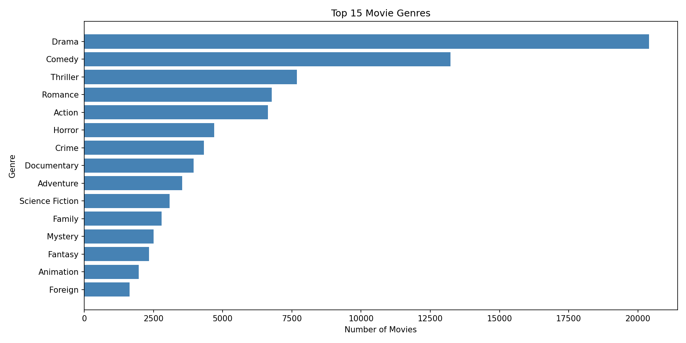
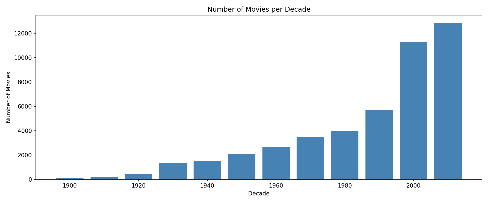
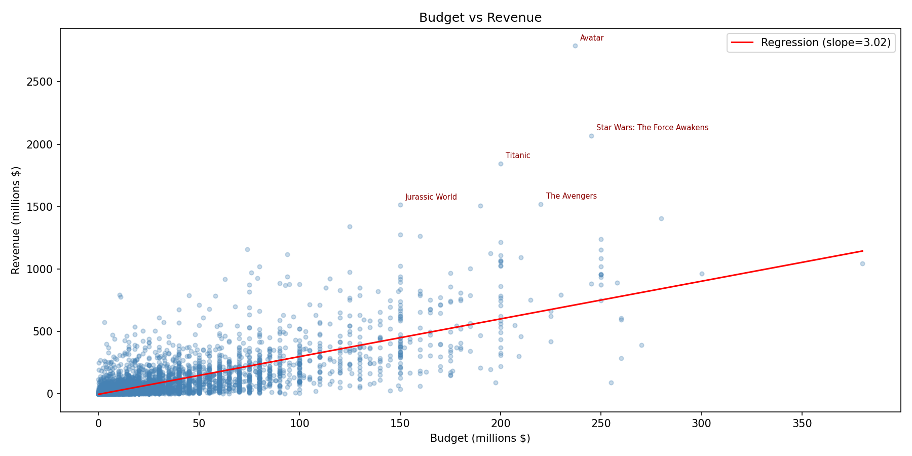
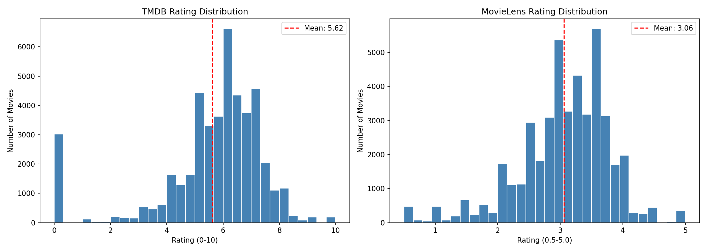
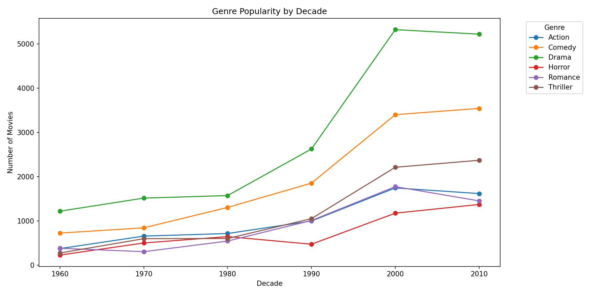
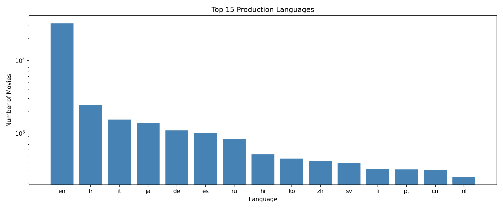
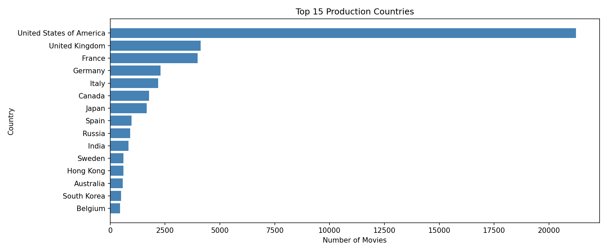
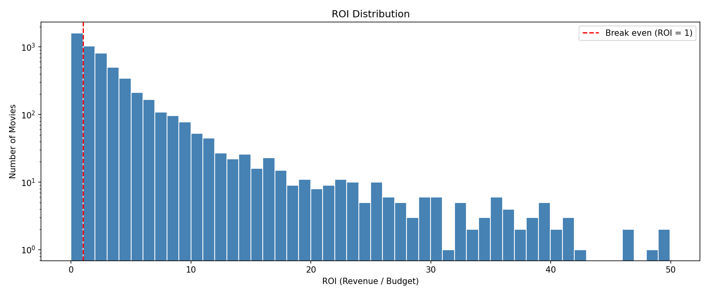
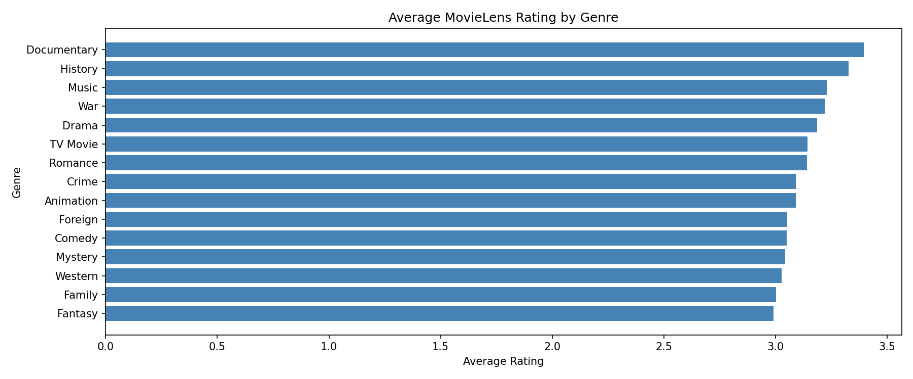

# Project of Data Visualization (COM-480)

| Student's name | SCIPER |
| -------------- | ------ |
|Hamza Barrada | 327986 |
|Amer Lakrami | 344911 |
|Ziad Chentouf | 344912 |
|Salma EL YADOUNI | 340859 |

## Getting Started

### 1. Clone the repository
```bash
git clone git@github.com:com-480-data-visualization/com-480-project-XLB.git
cd com-480-project-XLB
```

### 2. Create and activate the conda environment
```bash
conda create -n movies-viz python=3.11 -y
conda activate movies-viz
pip install kaggle pandas matplotlib seaborn jupyter
```

### 3. Download the dataset
### Option 1 — Kaggle CLI (recommended)

```bash
kaggle datasets download -d rounakbanik/the-movies-dataset -p data/raw/ --unzip
```

Verify the download:
```bash
ls -lh data/raw/
```
### Alternative: Manual Download
1. Go to https://www.kaggle.com/datasets/rounakbanik/the-movies-dataset
2. Click **Download** (requires free Kaggle account)
3. Unzip the downloaded file
4. Move all CSV files into `data/raw/`:
```bash
mv ~/Downloads/archive/* data/raw/
```

See `data/README.md` for details on each file.

[Milestone 1](#milestone-1) • [Milestone 2](#milestone-2) • [Milestone 3](#milestone-3)

## Milestone 1 (20th March, 5pm)

**10% of the final grade**

This is a preliminary milestone to let you set up goals for your final project and assess the feasibility of your ideas.
Please, fill the following sections about your project.

*(max. 2000 characters per section)*

### Dataset

The dataset we chose is **The Movies Dataset**, publicly available on [Kaggle](https://www.kaggle.com/datasets/rounakbanik/the-movies-dataset) (originally sourced from The Movie Database, TMDb). It consists of several interconnected CSV files covering approximately **45,000 movies** released between 1874 and 2017.

**The core files are:**
- `movies_metadata.csv` — titles, genres, budget, revenue, release dates, runtime, vote average and vote count
- `credits.csv` — full cast and crew information (actors, directors, writers) stored as nested JSON strings
- `keywords.csv` — thematic tags associated with each movie
- `ratings.csv` — over 26 million ratings from 270,000 users on a 1–5 scale
- `links.csv` — IMDb and TMDb IDs used to join tables

**Data quality assessment:** The dataset is generally well-structured but requires moderate preprocessing. The most significant issues are:
1. The `budget` and `revenue` columns contain many zero values representing missing data rather than actual zeros, which must be filtered before any financial analysis
2. The `credits` and `genres` columns store data as nested JSON strings that need to be parsed with Python's `ast` module
3. A small number of duplicate entries exist and must be removed
4. Some release dates are malformed or missing, requiring date parsing with error handling

Despite these issues, the dataset is rich enough to support a wide range of visualizations with manageable preprocessing effort. We work with all five files. From credits.csv we extracted director names and top 3 billed cast members per movie. From ratings.csv (26 million ratings) we computed per-movie average ratings and vote counts. All preprocessing produces two clean files saved to data/processed/: movies.csv (one row per movie, 21 columns) and ratings_enriched.csv (one row per rating with full movie metadata attached).

### Problematic

Cinema is one of the most universal forms of cultural expression, generating over **$100 billion** in global revenue annually and reaching audiences worldwide. Behind every film lies a complex set of decisions — such as genre, budget, and release timing — that influence whether it becomes a commercial success or fades into obscurity.

Our visualization explores the question: What factors drive financial and critical success in movies, and how have these relationships evolved over time? We analyze the interplay between production characteristics (such as budget and genre) and outcomes (box office revenue and audience ratings), while tracking how these patterns have shifted across decades.

We are particularly interested in questions such as:
- Do higher budgets reliably translate into higher revenue?
- How strongly are audience ratings correlated with financial success?
- Which genres have risen or declined in popularity and profitability over time?

The **target audience** is broad, including film enthusiasts, students, and general audiences curious about the dynamics of the movie industry. The project emphasizes interactive exploration, allowing users to test their own hypotheses and uncover patterns rather than passively consuming static visualizations.

This project is motivated by the combination of cultural relevance and data richness: movies are widely relatable, while the dataset provides enough depth to reveal non-obvious insights. Our goal is to transform raw data into a clear and engaging narrative about the evolving relationship between creativity and commercial success in filmmaking.

### Exploratory Data Analysis

We conducted a preliminary exploration of the dataset to assess its structure, quality, and potential for visualization.

### Basic Statistics
The core file `movies_metadata.csv` contains **45,466 entries** and 24 columns. After filtering out rows with missing or zero budget revenue values, approximately **5,393 movies** remain usable for financial analysis — sufficient for meaningful trends. The TMDB average rating is **6.08 out of 10** while the MovieLens average rating is 3.49 out of 5.0, equivalent to approximately 7 out of 10 on the same scale with a standard deviation of 1.19, forming a roughly normal distribution slightly skewed toward positive scores. Runtime averages around **94 minutes**.

### Genre Distribution
After parsing the nested JSON genre field, **Drama (20%)**, **Comedy (13%)**, and **Thriller (9%)** are the three most frequent genres. Genre composition shifts noticeably across decades — Westerns dominated the 1950s–60s, while Action and Science Fiction surged from the 1980s onward.



### Temporal Distribution
The dataset is heavily skewed toward recent decades, with over 60% of films released after 1990, reflecting both the growth of the industry and increased data availability.



### Budget vs. Revenue
A scatter plot of budget against revenue reveals a positive but noisy correlation. Notable outliers include films like **Avatar** and **Titanic**, which returned 10x+ their budgets. Many mid-budget films underperform, suggesting diminishing returns.



### Rating Distribution


### Genre Evolution Over Decades


### Top Languages


### Top Production Countries


### ROI Distribution


### Genre vs Average Rating


### Missing Data
| Column | Missing Values |
|---|---|
| `budget` | 36,573 zeros replaced with NaN (80%) |
| `revenue` | 38,052 zeros replaced with NaN (84%) |
| `runtime` | 263 NaN |
| `release_date` | 87 NaN |
| `vote_average` | 6 NaN |

We will handle this through **filtering rather than imputation**.

### Related work


The Movies Dataset is one of the most popular datasets on Kaggle, with hundreds of public notebooks exploring it. However, the vast majority of existing work consists of **static, beginner-level EDA** — genre bar charts, rating histograms, and simple budget/revenue scatter plots. Very few go beyond descriptive statistics, and almost none produce interactive or narrative-driven visualizations.

Notable existing work includes Kaggle notebooks that perform correlation analysis between budget and revenue, and a few that attempt sentiment analysis on movie overviews. On a broader scale, projects like [The Pudding's "Film Dialogue" analysis](https://pudding.cool/2017/03/film-dialogue/) demonstrate how cinematic data can be transformed into compelling visual essays — this is a key source of inspiration for our approach to storytelling.

**Our approach is original in three ways:**
1. We will build **fully interactive visualizations in D3.js**, allowing users to filter and explore the data themselves rather than presenting static images
2. We will construct an **actor-director collaboration network graph**, an angle rarely explored visually with this dataset
3. We will frame the entire project as a **narrative journey through cinema history**, combining temporal, financial, and social dimensions into a cohesive story rather than isolated charts

Visual inspiration also comes from the New York Times' data journalism pieces on the film industry, [Letterboxd's](https://letterboxd.com) user rating interfaces, and D3.js graph examples for network visualization. None of our team members have previously used this dataset in any ML, ADA, or semester project.

## Milestone 2 (17th April, 5pm)

**10% of the final grade**


## Milestone 3 (29th May, 5pm)

**80% of the final grade**


## Late policy

- < 24h: 80% of the grade for the milestone
- < 48h: 70% of the grade for the milestone


---